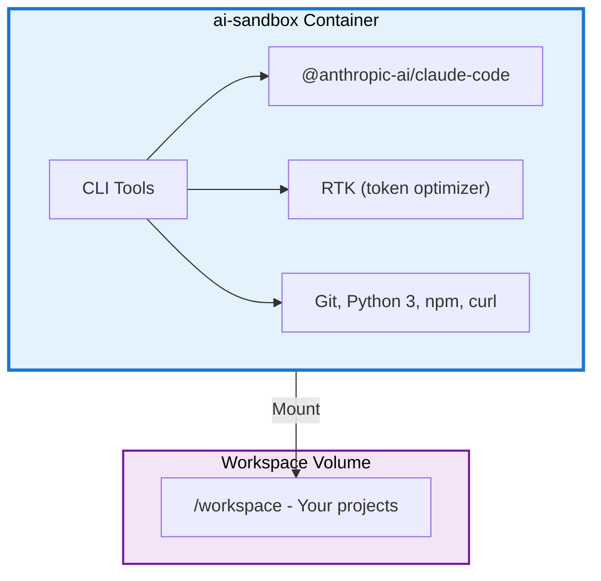

<div align="center">

# AI Sandbox

[](https://github.com/fisheatfish/ai-sandbox/actions/workflows/ci.yml)

A Docker sandbox for developers who want to explore and experiment with AI coding tools like **Claude Code** in an isolated, reproducible environment.


</div>

## What's Inside

- **ai-sandbox**: Node.js 22 container with Claude Code CLI, [RTK](https://github.com/rtk-ai/rtk), and [Pi](https://pi.dev) pre-installed

## Prerequisites

- **Docker and Docker Compose** installed ([Docker Desktop](https://www.docker.com/products/docker-desktop) or [Colima](https://github.com/abiosoft/colima))
- API keys for the AI tools you want to use

## Quick Start

### 1. Configure environment variables

```bash
cp .example.env .env
```

Edit `.env` with your workspace path and API keys:

```dotenv
# Root directory for sandbox data (workspace, CLI config)
SANDBOX_WORKSPACE=/path/to/your/sandbox-workspace

# API keys (optional — add only what you need)
# GITHUB_TOKEN=your_github_token_here
```

> **Security Warning — Read Before Adding API Keys**
>
> Any secret you put in `.env` will be accessible to the AI agents running inside the container. The LLM can read environment variables, files, and shell history. To protect yourself:
>
> - **Set expiration dates** on all API keys and tokens
> - **Rotate keys regularly** (e.g., weekly or after each session)
> - **Use fine-grained tokens** with the minimum required permissions
> - **Set spending limits / cost barriers** on API accounts to prevent runaway costs
> - **Never reuse production keys** — create dedicated keys for the sandbox
> - **Revoke keys immediately** if you suspect they have been compromised
>
> The `.env` file is gitignored to prevent accidental commits, but the AI agent inside the container **will** have access to these values at runtime.

### 2. Build and run

```bash
mkdir -p $(grep SANDBOX_WORKSPACE .env | cut -d= -f2)/workspace
docker build -t ai-sandbox .
docker-compose up -d
docker exec -it ai-sandbox bash
```

## Quick Access Alias

```bash
alias ai-sandbox="cd /path/to/ai-sandbox/ && docker-compose up -d --build && docker exec -it ai-sandbox bash"
```

## Architecture



## Autonomous Git Push

To let Claude create branches, commit, and push:

1. Create a [fine-grained token](https://github.com/settings/tokens?type=beta) with **Contents** (read/write) permission
2. Add `GITHUB_TOKEN=ghp_xxxx` to your `.env`
3. Inside the container, configure git:

```bash
git config --global user.name "Your Name"
git config --global user.email "your@email.com"
git config --global url."https://${GITHUB_TOKEN}@github.com/".insteadOf "https://github.com/"
```

> **Security note:** The `insteadOf` rule stores the token in `~/.gitconfig` in plain text. Use minimum scopes and rotate regularly.

## RTK — Token Optimizer

[RTK](https://github.com/rtk-ai/rtk) is pre-installed in the sandbox. It reduces LLM token consumption by 60-90% by filtering and compressing command outputs (git, docker, tests, etc.).

```bash
# Use it as a prefix for any command
rtk git status
rtk docker ps

# Or enable the hook to automatically rewrite commands
rtk init -g 
```

Once the hook is installed, commands like `git status` are automatically rewritten to `rtk git status` — Claude never sees the transformation.

## Codeburn (Token Spend Analytics)

[Codeburn](https://github.com/codeburn-io/codeburn) reads Claude Code session data to show where your AI spend goes. Since sessions run inside the container, you need to expose them to your host:

```bash
# On your host — symlink the container's .claude data to your local home
ln -sf ${SANDBOX_WORKSPACE}/ai-cli-data/.claude ~/.claude
```

This works because `docker-compose.yml` mounts `ai-cli-data/` as `/home/aiuser/`, so all session data persists there. The symlink lets codeburn (running on the host) read it directly.

## Codeburn (Token Spend Analytics)

[Codeburn](https://github.com/codeburn-io/codeburn) reads Claude Code session data to show where your AI spend goes. Since sessions run inside the container, you need to expose them to your host:

```bash
# On your host — symlink the container's .claude data to your local home
ln -sf ${SANDBOX_WORKSPACE}/ai-cli-data/.claude ~/.claude
```

This works because `docker-compose.yml` mounts `ai-cli-data/` as `/home/aiuser/`, so all session data persists there. The symlink lets codeburn (running on the host) read it directly.

## TODO / Roadmap

- [ ] Add a startup script to automate git config inside the container
- [ ] Support additional AI coding tools (Codex, Gemini CLI, etc.)
- [ ] Move the per-project `.venv-docker` virtualenvs off the bind mount onto a native Docker volume.

## Contributing

See [CONTRIBUTING.md](CONTRIBUTING.md) for git workflow and PR guidelines.

## License

This project is licensed under the [Apache License 2.0](LICENSE).
