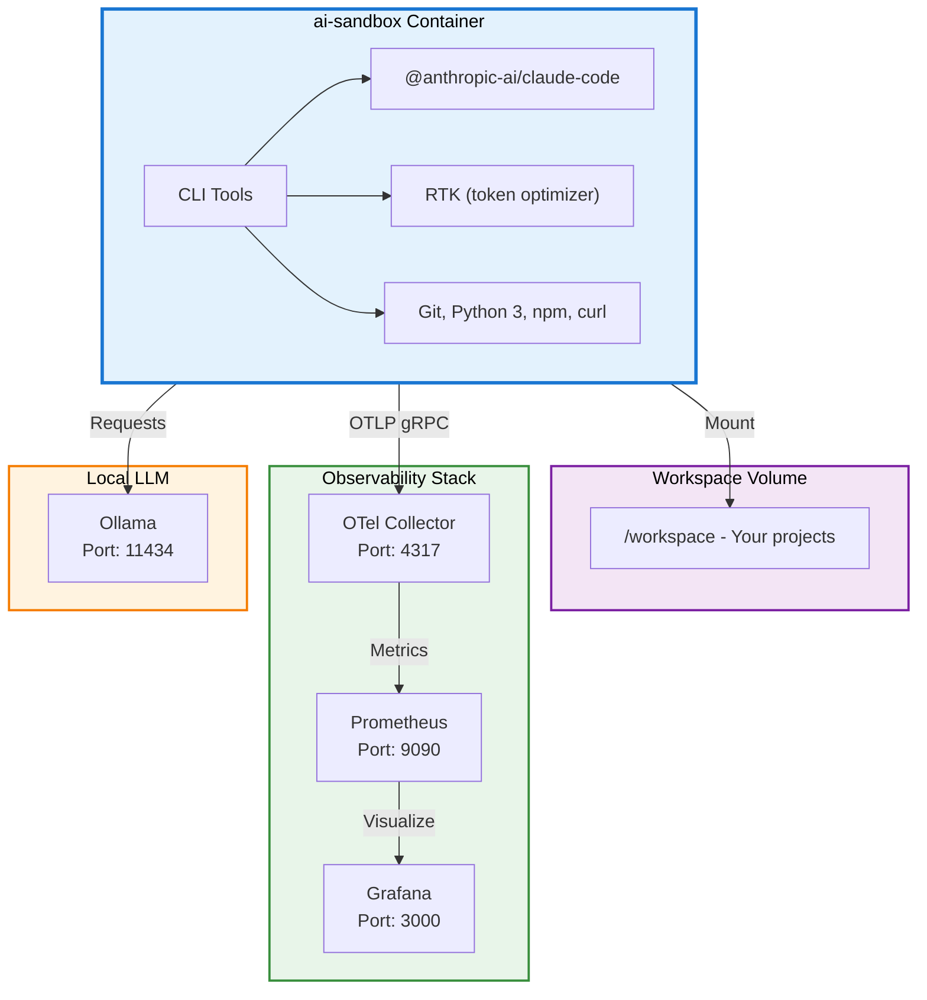

# AI Sandbox

[](https://github.com/fisheatfish/ai-sandbox/actions/workflows/ci.yml)

A Docker sandbox for developers who want to explore and experiment with AI coding tools like **Claude Code** in an isolated, reproducible environment.


## What's Inside

- **ai-sandbox**: Node.js 20 container with Claude Code CLI and [RTK](https://github.com/rtk-ai/rtk) pre-installed
- **Ollama**: Local LLM support for open-source models
- **Observability stack**: OpenTelemetry Collector, Prometheus, and Grafana

## Prerequisites

- **Docker and Docker Compose** installed ([Docker Desktop](https://www.docker.com/products/docker-desktop) or [Colima](https://github.com/abiosoft/colima))
- API keys for the AI tools you want to use

## Quick Start

### 1. Configure environment variables

```bash
cp .example.env .env
```

Edit `.env` with your workspace path and API keys:

```dotenv
# Root directory for sandbox data (workspace, CLI config)
SANDBOX_WORKSPACE=/path/to/your/sandbox-workspace

# API keys (optional — add only what you need)
# GITHUB_TOKEN=your_github_token_here
```

> **Security Warning — Read Before Adding API Keys**
>
> Any secret you put in `.env` will be accessible to the AI agents running inside the container. The LLM can read environment variables, files, and shell history. To protect yourself:
>
> - **Set expiration dates** on all API keys and tokens
> - **Rotate keys regularly** (e.g., weekly or after each session)
> - **Use fine-grained tokens** with the minimum required permissions
> - **Set spending limits / cost barriers** on API accounts to prevent runaway costs
> - **Never reuse production keys** — create dedicated keys for the sandbox
> - **Revoke keys immediately** if you suspect they have been compromised
>
> The `.env` file is gitignored to prevent accidental commits, but the AI agent inside the container **will** have access to these values at runtime.

### 2. Build and run

```bash
mkdir -p $(grep SANDBOX_WORKSPACE .env | cut -d= -f2)/workspace
docker build -t ai-sandbox .
docker-compose up -d
docker exec -it ai-sandbox bash
```

## Interfaces

| Service | URL |
|---------|-----|
| Grafana | http://localhost:3000 |
| Prometheus | http://localhost:9090 |
| Ollama | http://localhost:11434 |

## Quick Access Alias

```bash
alias ai-sandbox="cd /path/to/ai-sandbox/ && docker-compose up -d --build && docker exec -it ai-sandbox bash"
```

## Architecture



## Autonomous Git Push

To let Claude create branches, commit, and push:

1. Create a [fine-grained token](https://github.com/settings/tokens?type=beta) with **Contents** (read/write) permission
2. Add `GITHUB_TOKEN=ghp_xxxx` to your `.env`
3. Inside the container, configure git:

```bash
git config --global user.name "Your Name"
git config --global user.email "your@email.com"
git config --global url."https://${GITHUB_TOKEN}@github.com/".insteadOf "https://github.com/"
```

> **Security note:** The `insteadOf` rule stores the token in `~/.gitconfig` in plain text. Use minimum scopes and rotate regularly.

## RTK — Token Optimizer

[RTK](https://github.com/rtk-ai/rtk) is pre-installed in the sandbox. It reduces LLM token consumption by 60-90% by filtering and compressing command outputs (git, docker, tests, etc.).

```bash
# Use it as a prefix for any command
rtk git status
rtk docker ps

# Or enable the hook to automatically rewrite commands
rtk init -g 
```

Once the hook is installed, commands like `git status` are automatically rewritten to `rtk git status` — Claude never sees the transformation.

## Using Ollama for Local Models

```bash
# From inside the container
curl http://ollama:11434/api/tags    # List models
ollama run mistral                    # Run a model
```

## Observability

| Component | Port | Config |
|-----------|------|--------|
| OTel Collector | 4317 (gRPC) | [otel-collector-config.yaml](observability/otel-collector-config.yaml) |
| Prometheus | 9090 | [prometheus.yml](observability/prometheus.yml) |
| Grafana | 3000 | Volume: `grafana-data` |

Enable telemetry in `docker-compose.yml`:

```yaml
environment:
  - CLAUDE_CODE_ENABLE_TELEMETRY=1
  - OTEL_METRICS_EXPORTER=otlp
  - OTEL_EXPORTER_OTLP_ENDPOINT=http://otel-collector:4317
```

## TODO / Roadmap

- [ ] Add a startup script to automate git config inside the container
- [ ] Support additional AI coding tools (Codex, Gemini CLI, etc.)
- [ ] Move the per-project `.venv-docker` virtualenvs off the bind mount onto a native Docker volume.

## Contributing

See [CONTRIBUTING.md](CONTRIBUTING.md) for git workflow and PR guidelines.

## License

This project is licensed under the [Apache License 2.0](LICENSE).
